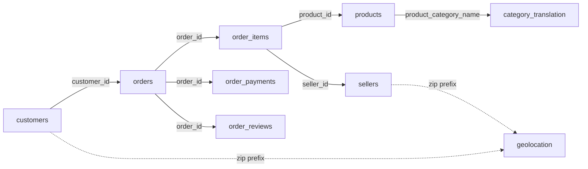

# Olist E-Commerce: Raw Data Audit

**Notebook:** `01_raw_data_exploration`
**Scope:** All 9 raw CSVs in `data/raw/`, loaded as `raw_*` DataFrames. No modifications were made to the source data. This document records observations only; cleaning decisions are documented separately.

---

## 1. Table Overview

| Table | Rows | Cols | Nulls | Full-row duplicates |
|---|---:|---:|---|---:|
| customers | 99,441 | 5 | None | 0 |
| orders | 99,441 | 8 | 3 columns (see §3.2) | 0 |
| order_items | 112,650 | 7 | None | 0 |
| order_payments | 103,886 | 5 | None | 0 |
| order_reviews | 99,224 | 7 | 2 columns (see §3.5) | 0 |
| products | 32,951 | 9 | 8 columns (see §3.6) | 0 |
| category_translation | 71 | 2 | Not checked | Not checked |
| sellers | 3,095 | 4 | None | 0 |
| geolocation | 1,000,163 | 5 | None | **261,831** |

---

## 2. Table Structure and Relationships

| From | To | Key | Observed relationship |
|---|---|---|---|
| customers | orders | `customer_id` | one to one (99,441 unique ids on both sides) |
| orders | order_items | `order_id` | one to many (mean 1.14 items per order, max 21) |
| orders | order_payments | `order_id` | one to many (max 29 payment rows per order) |
| orders | order_reviews | `order_id` | one to many (some orders have up to 3 reviews) |
| order_items | products | `product_id` | many to one |
| order_items | sellers | `seller_id` | many to one |
| products | category_translation | `product_category_name` | many to one (2 categories have no translation) |
| customers / sellers | geolocation | zip prefix | many to many (geolocation has many rows per zip prefix) |

**Grain (what one row means):**

| Table | One row is |
|---|---|
| customers | one `customer_id` (an order-level customer id; `customer_unique_id` identifies the real person) |
| orders | one order |
| order_items | one item line within an order |
| order_payments | one payment record within an order |
| order_reviews | one review record (not guaranteed one per order, see §3.5) |
| products | one product |
| category_translation | one product category |
| sellers | one seller |
| geolocation | one coordinate record (many per zip prefix) |

---

## 3. Table-by-Table Findings

### 3.1 Customers
- Columns: `customer_id`, `customer_unique_id`, `customer_zip_code_prefix`, `customer_city`, `customer_state`.
- No nulls, no duplicate rows.
- `customer_id` unique: 99,441 (one per row). `customer_unique_id` unique: **96,096**, so 3,345 `customer_id` values are extra ids for repeat customers.
- 27 states; 4,119 unique cities.
- City `strip()` + `lower()` leaves the unique count unchanged, so cities are already stripped and lower-cased.
- **One city name contains a digit: `quilmetro 14 do mutum` (state ES).**
- Top states by rows: SP 41,746 · RJ 12,852 · MG 11,635 · RS 5,466 · PR 5,045 · SC 3,637 · BA 3,380 · DF 2,140 · ES 2,033 · GO 2,020.
- Smallest states: AC 81 · AP 68 · RR 46.
- Top cities: sao paulo 15,540 · rio de janeiro 6,882 · belo horizonte 2,773 · brasilia 2,131 · curitiba 1,521.
- `customer_zip_code_prefix` is `int64`, range 1003 to 99990 (leading zeros are not preserved).

### 3.2 Orders
- Columns: `order_id`, `customer_id`, `order_status`, `order_purchase_timestamp`, `order_approved_at`, `order_delivered_carrier_date`, `order_delivered_customer_date`, `order_estimated_delivery_date`.
- 99,441 unique `order_id`; no duplicate rows.
- All 5 date columns load as `str` and needed `pd.to_datetime`.
- Nulls: `order_approved_at` 160 · `order_delivered_carrier_date` 1,783 · `order_delivered_customer_date` 2,965.
- 8 unique status values.

**Status distribution**

| Status | Count |
|---|---:|
| delivered | 96,478 |
| shipped | 1,107 |
| canceled | 625 |
| unavailable | 609 |
| invoiced | 314 |
| processing | 301 |
| created | 5 |
| approved | 2 |

**Nulls by status**

| Null column | Total | Breakdown by status |
|---|---:|---|
| `order_approved_at` | 160 | canceled 141 · delivered 14 · created 5 |
| `order_delivered_carrier_date` | 1,783 | unavailable 609 · canceled 550 · invoiced 314 · processing 301 · created 5 · approved 2 · delivered 2 |
| `order_delivered_customer_date` | 2,965 | shipped 1,107 · canceled 619 · unavailable 609 · invoiced 314 · processing 301 · delivered 8 · created 5 · approved 2 |

- Each breakdown sums to its column total.
- **`delivered` orders with missing timestamps: 14 without approval, 2 without carrier date, 8 without customer delivery date.**
- Reconciling the delivery-date nulls: 2,965 nulls = 8 delivered + 2,957 non-delivered. Non-delivered orders total 2,963, so 6 non-delivered orders still carry a delivery date. These are all `canceled` (625 − 619 = 6).

**Timestamp sequence checks (after datetime conversion)**

| Check | Rows |
|---|---:|
| purchase > approved | 0 |
| approved > carrier pickup | 1,359 |
| carrier pickup > customer delivery | 23 |
| customer delivery > estimated delivery (late) | 7,827 |

- Late deliveries are about 8.1% of orders that have a delivery date (7,827 / 96,476).
- The counts of 1,359 and 23 are sequence violations, not nulls.

### 3.3 Order Items
- Columns: `order_id`, `order_item_id`, `product_id`, `seller_id`, `shipping_limit_date`, `price`, `freight_value`. Loaded dtypes: str, int, str, str, str, float, float.
- 112,650 rows, 0 nulls, 0 duplicate rows, 0 duplicates on (`order_id`, `order_item_id`).
- Unique counts:

| Column | Unique |
|---|---:|
| order_id | 98,666 |
| order_item_id | 21 (range 1 to 21) |
| product_id | 32,951 |
| seller_id | 3,095 |
| shipping_limit_date | 93,318 |
| price | 5,968 |
| freight_value | 6,999 |

- Items per order: mean 1.14, median 1, 75th percentile 1, max 21.
- Multiple units of the same product appear as repeated rows with incrementing `order_item_id`.
- `shipping_limit_date` parsed cleanly (0 NaT).

| Column | Min | Median | Mean | Max |
|---|---:|---:|---:|---:|
| price | 0.85 | 74.99 | 120.65 | 6,735.00 |
| freight_value | 0.00 | 16.26 | 19.99 | 409.68 |

- `price <= 0`: 0 rows. `freight_value < 0`: 0 rows.
- **`freight_value == 0`: 383 rows (0.34%)**, spread across 9 sellers. Four sellers account for 369 of them (96.3%): 158, 99, 56 and 56 rows. The other five sellers have 9, 2, 1, 1 and 1.
- **`price < freight_value`: 4,124 rows (3.66%).**

### 3.4 Order Payments
- Columns: `order_id`, `payment_sequential`, `payment_type`, `payment_installments`, `payment_value`. Loaded dtypes: str, int, str, int, float.
- 103,886 rows, 0 nulls, 0 duplicate rows.
- Payments per order: 99,440 orders have payment rows; 96,479 have exactly 1 row (2 rows: 2,382 · 3 rows: 301 · 4 rows: 108 · 5 rows: 52), max 29.
- `payment_sequential` max 29; `payment_installments` max 24, mean 2.85.
- `payment_value`: min 0.00, median 100.00, mean 154.10, max 13,664.08.
- Sum of `payment_value` grouped by order equals the raw sum: 16,008,872.12 (float noise at 1e-9 only).

**Payment types**

| Type | Count |
|---|---:|
| credit_card | 76,795 |
| boleto | 19,784 |
| voucher | 5,775 |
| debit_card | 1,529 |
| **not_defined** | **3** |

- `not_defined`: 3 rows, all with `payment_value` 0.0, `payment_installments` 1 and `payment_sequential` 1.
- `payment_value == 0`: 9 rows (3 `not_defined` + 6 `voucher`). `payment_value < 0`: 0 rows.
- `payment_installments == 0`: **2 rows**, both `credit_card`, `payment_sequential` 2 (values 58.69 and 129.94).
- Installments are heavily skewed to 1 (52,546 rows), with notable spikes at 8 (4,268) and 10 (5,328).

### 3.5 Order Reviews
- Columns: `review_id`, `order_id`, `review_score`, `review_comment_title`, `review_comment_message`, `review_creation_date`, `review_answer_timestamp`.
- 99,224 rows, 0 duplicate rows.
- Nulls: `review_comment_title` 87,656 (11.7% populated) · `review_comment_message` 58,247 (41.3% populated).
- Both date columns load as `str` and were converted to datetime; 0 NaT in both. `review_creation_date > review_answer_timestamp`: 0 rows. `review_score <= 0`: 0 rows.

**Score distribution** (mean 4.09, std 1.35)

| Score | Count |
|---:|---:|
| 5 | 57,328 |
| 4 | 19,142 |
| 3 | 8,179 |
| 2 | 3,151 |
| 1 | 11,424 |

**Key structure findings**
- Unique `review_id`: **98,410** · unique `order_id`: **98,673** · rows: 99,224.
- Order-level repeats: 551 excess rows; four orders have 3 reviews each. One `order_id` can map to several reviews with different `review_id`, timestamps and scores. Example: order `03c939fd…` has three distinct `review_id`s with scores 3, 4, 3 on different dates.
- `review_id` repeats: 814 excess rows. The same `review_id` appears against multiple different orders (for example `4d0e6dd0…` on 3 orders, with the same score, dates, title and message). The top 10 `review_id`s all appear 3 times.
- 768 orders have no review (99,441 − 98,673).
- Whitespace-only comments were converted to NaN with a regex replace. The follow-up `== ''` check returned 0 for both comment columns.

### 3.6 Products
- Columns: `product_id`, `product_category_name`, `product_name_lenght`, `product_description_lenght`, `product_photos_qty`, `product_weight_g`, `product_length_cm`, `product_height_cm`, `product_width_cm` (shape 32,951 × 9). The source column names carry the original spelling `lenght`.
- 32,951 unique `product_id`; 0 duplicate rows; 73 unique category names; 0 blank-string categories.

**Nulls** (`product_id`: 0)

| Column | Nulls |
|---|---:|
| product_category_name | 610 |
| product_name_lenght | 610 |
| product_description_lenght | 610 |
| product_photos_qty | 610 |
| product_weight_g | 2 |
| product_length_cm | 2 |
| product_height_cm | 2 |
| product_width_cm | 2 |

- The four 610-null columns are null on the same 610 rows, and those rows still have weight and dimensions populated.
- The four 2-null columns are null on the same 2 rows: `09ff539a…` (category `bebes`, name/description/photos present) and `5eb56465…` (also null category, name, description, photos).
- `product_weight_g == 0`: **4 rows**, all in one category, `cama_mesa_banho`, dimensions 30 × 25 × 30 cm.
- Zero checks on name length, description length, photos qty, length, height and width: 0 rows each. Negative checks on all 7 numeric columns: 0 rows each.

### 3.7 Category Translation
- Shape: 71 rows × 2 columns (`product_category_name`, `product_category_name_english`).
- 71 unique Portuguese names, 71 unique English names.
- Categories in `products` with no translation: **`pc_gamer`**, **`portateis_cozinha_e_preparadores_de_alimentos`**, plus NaN (from the 610 null-category products).
- 73 category names in products vs. 71 in the translation table, consistent with the two missing above.

### 3.8 Sellers
- Columns: `seller_id`, `seller_zip_code_prefix`, `seller_city`, `seller_state`.
- 3,095 unique `seller_id`, each appearing once; 0 nulls; 0 duplicate rows.
- 23 unique states (vs. 27 for customers); 611 unique cities.
- No blank-string city or state.
- **One seller's city value is a numeric string, `04482255`.**
- `seller_zip_code_prefix` range 1001 to 99730.

### 3.9 Geolocation
- 1,000,163 rows; 0 nulls.
- 19,015 unique zip prefixes; rows per prefix: min 1, median 29, mean 52.6, max 1,146.
- **Full-row duplicates: 261,831 (26.2%).**
- **Coordinate ranges extend beyond Brazil:** lat −36.61 to **45.07**; lng −101.47 to **121.11**. Brazil lies roughly between 5°N–34°S and 35°W–74°W. The number of out-of-bounds rows was not measured in this notebook.
- 27 states; SP 404,268 · MG 126,336 · RJ 121,169 · RS 61,851 · PR 57,859.
- Unique cities: 8,011 raw vs. 8,010 after strip + lowercase (1 city differs only by whitespace or case).
- Zip coverage against geolocation:
  - **157** distinct customer zip prefixes are absent from geolocation.
  - **7** distinct seller zip prefixes are absent (2285, 7412, 37708, 71551, 72580, 82040, 91901).
- A draft `geo_lookup` (mean lat/lng, modal city/state per zip) has shape (19,015 × 5).

---

## 4. Cross-Table Referential Integrity

| Relationship | Result |
|---|---|
| customers with no order | 0 |
| orders with no customer | 0 |
| order_items with no order | 0 |
| **orders with no order_items** | **775** |
| order_items with no product | 0 |
| products never sold | 0 |
| order_items with no seller | 0 |
| sellers with no items | 0 |
| payments with no order | 0 |
| **orders with no payment** | **1** |
| reviews with no order | 0 |

**The 775 orders with no items, by status:** canceled 164 · unavailable 603 · created 5 · invoiced 2 · shipped 1.
The one `shipped` order is `a68ce168…`: purchased 2016-10-05, approved 2016-10-07, carrier date 2016-11-07, no delivery date, estimated delivery 2016-12-01.

---

## 5. Issue Register (observations only)

| # | Table | Observation | Scale |
|---|---|---|---|
| 1 | customers | City name containing a digit (`quilmetro 14 do mutum`, ES) | 1 city |
| 2 | orders | Approval timestamp later than carrier pickup | 1,359 rows |
| 3 | orders | Carrier pickup later than customer delivery | 23 rows |
| 4 | orders | Null approval / carrier / delivery dates (mostly non-delivered statuses) | 160 / 1,783 / 2,965 |
| 5 | orders | `delivered` orders missing approval / carrier / delivery date | 14 / 2 / 8 |
| 6 | orders | `canceled` orders that still have a delivery date | 6 |
| 7 | orders / order_items | Orders with no line items | 775 (mostly canceled/unavailable) |
| 8 | orders / payments | Order with no payment record | 1 |
| 9 | order_items | `freight_value == 0`, concentrated in 4 sellers | 383 rows |
| 10 | order_items | `freight_value > price` | 4,124 rows |
| 11 | payments | `payment_type = not_defined` (all value 0.0) | 3 rows |
| 12 | payments | `payment_installments = 0` on credit_card rows | 2 rows |
| 13 | payments | Zero-value payments (3 not_defined + 6 voucher) | 9 rows |
| 14 | reviews | Multiple reviews per order | 551 excess rows |
| 15 | reviews | Same `review_id` linked to several orders | 814 excess rows |
| 16 | reviews | Comment title / message mostly empty | 87,656 / 58,247 nulls |
| 17 | products | Category + name/description/photos null together | 610 rows |
| 18 | products | Weight and dimensions null | 2 rows |
| 19 | products | `product_weight_g == 0` | 4 rows |
| 20 | translation | Two categories in products have no English name | 2 categories |
| 21 | sellers | City value that is a numeric string (`04482255`) | 1 seller |
| 22 | geolocation | Full-row duplicate rows | 261,831 rows |
| 23 | geolocation | Coordinates outside Brazil's extent | not measured |
| 24 | geolocation | Multiple coordinate rows per zip (up to 1,146) | 19,015 zips |
| 25 | geolocation | City name variant differing by whitespace/case | 1 city |
| 26 | customers / sellers | Zip prefixes missing from geolocation | 157 / 7 |
| 27 | customers / geolocation | Zip prefix stored as integer (leading zeros lost) | all rows |

---

## 6. Known Gaps / To Check Later

Checks that are not yet complete or recorded:

- **orders:** summary statistics of the two negative-gap series (approved > carrier, carrier > delivered); identity of the single order with no payment record.
- **products:** summary statistics of the numeric columns; number of products in the two untranslated categories.
- **geolocation:** number of zip prefixes with more than one state; number of out-of-bounds coordinate rows.
- **cross-table:** whether payment totals agree with item price plus freight per order; date range and monthly coverage of purchases.
